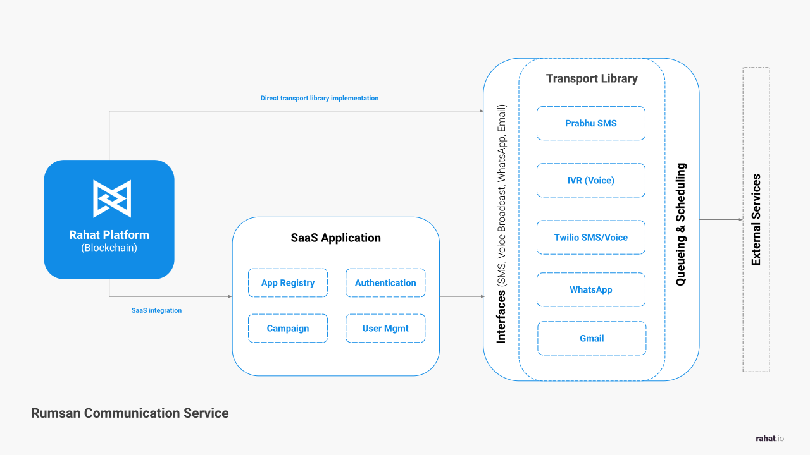

# Rumsan Connect

Rumsan connect is an communication hub that registers external services like SMS, Email, Asterisk (Voice), Slack, WhatsApp. It has a uniform method to broadcast messages to recepients. It has a built in queue and scheduling services to ensure all the messages are delivered successfully.

# High Level workflow




## Start the application

Run `npx nx serve connect` to start the development server.

## Transport setup

For API-based transports, see the step-by-step guide:

- [API Transport Setup](./docs/api-transport-setup.mdx)

# Input Interface

To broadcast messages to the intended audience, Rumsan Connect implements standard
interface to receive instruction. This instrution is then processed by the
application to send messages using the configured transports. Here is the
specification for the inststruction template:

```typescript
{
  transport: {
    type: "email" | "sms" | "whatsapp" | "voice",
    subject?: string,
    message?: string,
    fileUrl?: string,
    extras?: Record<string, any>
  },
  audience: string []  //address - email, phone number, whatsapp number
  options: {
    trigger: "immediate" | "scheduled" | "manual",
    scheduledTimestamp?: Date,
    retries: number, //default:0
    retryIntervalMinutes?: string, //default: 60 or 15,60,120,240
    webhookUrl?: string
  }
}
```

Once the system recevies the instruction, several steps are taken to process the
instruction and send intended messages to the audience. The steps are as
follows:

1. Validate the instruction. Ensure that the instruction is well-formed and
   contains all the required fields. Validation is provided by each transport.
2. If the instruction is valid, RS Connect creates a session with unique UUID
   (SessionId).
3. The session is stored in the database for tracking and logging purposes.
4. The instruction is processed by the application and added to transport queue.
5. The transport queue is processed by the transport worker or external service
   api to send messages to the intended audience.
6. Once the message is processed, post processing happens updating logs or
   calling webhook.

### Example Data

Here is the sample data. This data can be used to send voice broadcast message
to the audience of 7 phone numbers in Nepal. The message is scheduled to be sent
after 5 days.

```json
{
  "transport": {
    "type": "voice",
    "message": "Hello, this is a test message from RS Connect.",
    "fileUrl": "https://example.com/voice.mp3"
  },
  "audience": [
    "+9779812345678",
    "+9779812345679",
    "+9779812345680",
    "+9779812345681",
    "+9779812345682",
    "+9779812345683",
    "+9779812345684"
  ],
  "options": {
    "trigger": "scheduled",
    "scheduledTimestamp": "2021-12-31T23:59:59",
    "retries": 3,
    "retryIntervalMinutes": "60,180,600",
    "webhookUrl": "https://example.com/webhook"
  }
}
```

- [Home](./index.mdx)


## Build for production

Run `npx nx build connect` to build the application. The build artifacts are stored in the output directory (e.g. `dist/` or `build/`), ready to be deployed.

## Running tasks

To execute tasks with Nx use the following syntax:

```
npx nx <target> <project> <...options>
```

You can also run multiple targets:

```
npx nx run-many -t <target1> <target2>
```

..or add `-p` to filter specific projects

```
npx nx run-many -t <target1> <target2> -p <proj1> <proj2>
```

Targets can be defined in the `package.json` or `projects.json`. Learn more [in the docs](https://nx.dev/features/run-tasks).

## Connect with us!

- [Join the community](https://rumsan.com)
- [Follow us on LinkedIn](https://www.linkedin.com/company/rumsan)


